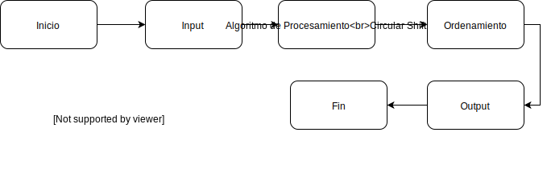

# KWIC
Implementación de KeyWord In Context con una arquitectura basada en Pipes & Filters.

Esta solución es un flujo de datos entre los siguientes filtros:

1. Input 
2. Algoritmo de Procesamiento (Circular shift)
3. Ordenamiento 
4. Output (Representación de datos)

